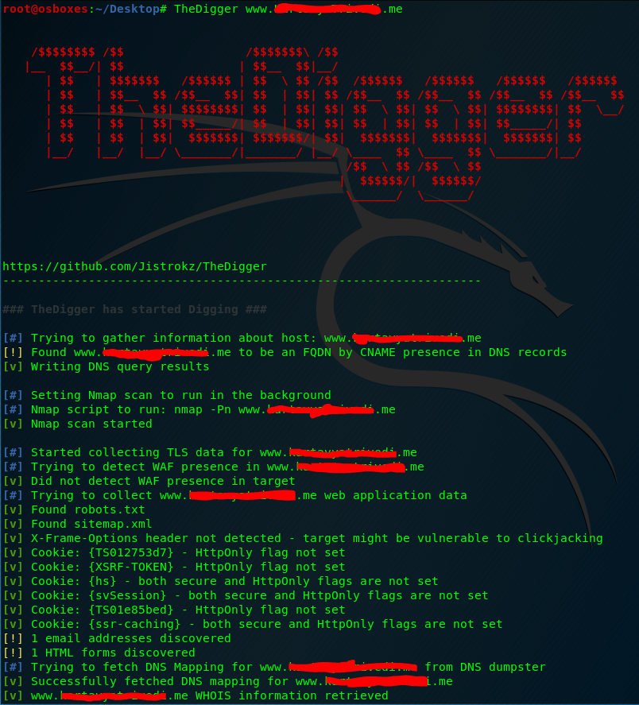
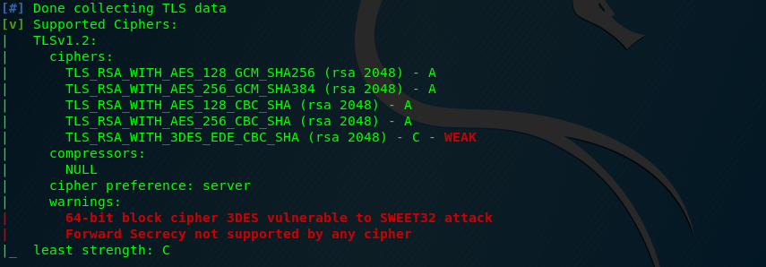
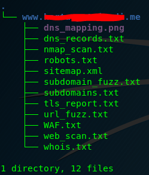

# TheDigger
<h2>
Red Team and Offensive Security Scanning and Reconnaisance Tool for Vulnerablity Analysis of Networks, Web Apps, and Cloud Services.
</h2>

 <br><br>                                               
TheDigger is capable of scanning and outputting the following details:
<br>
--> DNS Information <br>
--> Visual Representation of DNS mapping with the help of DNS dumpster<br>
--> TLD Data <br>
--> WHOIS data<br>
--> Port Scan <br>
--> Script scan <br>
--> Vulnerable service scan <br>
--> URL fuzzing <br>
--> Directory file detection <br>
--> subdomain enumeration <br>
--> Web application Data retrieval: <br>
&nbsp&nbsp&nbsp&nbsp&nbsp&nbsp&nbsp&nbsp--> CMS Detection <br>
&nbsp&nbsp&nbsp&nbsp&nbsp&nbsp&nbsp&nbsp-->webserver information <br>
&nbsp&nbsp&nbsp&nbsp&nbsp&nbsp&nbsp&nbsp--> robots.txt / sitemap.xmp <br>
&nbsp&nbsp&nbsp&nbsp&nbsp&nbsp&nbsp&nbsp-->cookie inspection <br>
&nbsp&nbsp&nbsp&nbsp&nbsp&nbsp&nbsp&nbsp--> detect WAF <br>
&nbsp&nbsp&nbsp&nbsp&nbsp&nbsp&nbsp&nbsp--> Tor/ Proxies <br>

<h4>Installation</h4>

``` 
sudo pip3 install TheDigger 
```

<h4> Usage </h4>

``` 
TheDigger -[options] <Target> 
```

<h4> Available options/ Parameters </h4>

``` Options:
  --version                      Show the version and exit.
  -d, --dns-records TEXT         Comma separated DNS records to query.
                                 Defaults to: A,MX,NS,CNAME,SOA,TXT
  --tor-routing                  Route HTTP traffic through Tor (uses port
                                 9050). Slows total runtime significantly
  --proxy-list TEXT              Path to proxy list file that would be used
                                 for routing HTTP traffic. A proxy from the
                                 list will be chosen at random for each
                                 request. Slows total runtime
  -c, --cookies TEXT             Comma separated cookies to add to the
                                 requests. Should be in the form of key:value
                                 Example: PHPSESSID:12345,isMobile:false
  --proxy TEXT                   Proxy address to route HTTP traffic through.
                                 Slows total runtime
  -w, --wordlist TEXT            Path to wordlist that would be used for URL
                                 fuzzing
  -T, --threads INTEGER          Number of threads to use for URL
                                 Fuzzing/Subdomain enumeration. Default: 25
  --ignored-response-codes TEXT  Comma separated list of HTTP status code to
                                 ignore for fuzzing. Defaults to:
                                 302,400,401,402,403,404,503,504
  --subdomain-list TEXT          Path to subdomain list file that would be
                                 used for enumeration
  -sc, --scripts                 Run Nmap scan with -sC flag
  -sv, --services                Run Nmap scan with -sV flag
  -f, --full-scan                Run Nmap scan with both -sV and -sC
  -p, --port TEXT                Use this port range for Nmap scan instead of
                                 the default
  --vulners-nmap-scan            Perform an NmapVulners scan. Runs instead of
                                 the regular Nmap scan and is longer.
  --vulners-path TEXT            Path to the custom nmap_vulners.nse script.If
                                 not used, Raccoon uses the built-in script it
                                 ships with.
  -fr, --follow-redirects        Follow redirects when fuzzing. Default: False
                                 (will not follow redirects)
  --tls-port INTEGER             Use this port for TLS queries. Default: 443
  --skip-health-check            Do not test for target host availability
  --no-url-fuzzing               Do not fuzz URLs
  --no-sub-enum                  Do not bruteforce subdomains
  --skip-nmap-scan               Do not perform an Nmap scan
  -q, --quiet                    Do not output to stdout
  -o, --outdir TEXT              Directory destination for scan output
  --help                         Show this message and exit.
  ```

  <h4>Screenshots </h4>

   <br>
  
  
  


        
